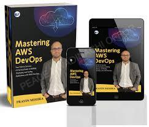

# Week 01 — Success Mindset (Mindset OS)

Part of the DevOps Micro Internship (DMI) with Agentic AI

---

## Task 1 — A Belief You Hold

### Question

What is something you believe to be true that most people around you would disagree with?

Write at least **50 words**. Be honest, specific, and use clear professional sentences.

### Your Answer

### Answer

I believe that talent is overrated, while consistency is underestimated. Most people around me believe that successful people are naturally gifted or simply got lucky. I disagree. From what I have experienced, the biggest difference between people who grow and those who remain stuck is their willingness to keep showing up, especially when progress is slow and invisible.

I have learned that skills are built through repetition, deliberate practice, and continuous improvement. Every time I chose to complete a task instead of waiting until I felt confident, I became more capable. That mindset has changed how I approach learning software engineering and DevOps. Instead of chasing quick results, I focus on building habits that compound over time.

This belief also influences how I measure success. I no longer compare myself to people who are years ahead of me. I compare today's version of myself with yesterday's. If I learn something new, solve a problem I could not solve before, or build one more project than I did last week, that is measurable progress. In the long run, disciplined consistency outperforms occasional bursts of motivation, and I believe that principle applies not only to technology but to every meaningful career.

---

## Task 2 — Three Objective Truths Discovered Through Experimentation

Write three objective truths you discovered through your own actions and results. For each truth, include one sentence for the truth and two to four lines of evidence from your life.

### Truth #1

**Truth**

Consistent execution produces measurable results, even when progress feels slow.

**Evidence from My Life**

Add your answer here...

### Truth #2

**Truth**

Add your answer here...

**Evidence from My Life**

Add your answer here...

### Truth #3

**Truth**

Add your answer here...

**Evidence from My Life**

I stopped waiting until I felt "ready" and committed to learning and building every day, even if it was for a short period. Within weeks, I had created a GitHub account, started documenting my work, completed technical tasks I once found intimidating, and gained confidence by seeing visible progress instead of relying on motivation.

---

## Task 3 — What Does Your 2.0 Version Look Like?

Write and publicly publish an article about your future professional self, written as if a journalist is writing about you **3–7 years from now**.

Your article must:

* Be at least **300 words**.
* Be written in the **past tense**, as if it has already happened.
* Include specific proof such as projects, portfolio, GitHub, blogs, certifications, job role, leadership, or community contribution.
* Be published on LinkedIn, Medium, WordPress, Blogspot, a personal blog, or a portfolio page.

### My Article

Paste your complete article here...

### Public Article URL

```text
Paste your published article URL here...
```

### LinkedIn Post URL

Create a LinkedIn post sharing your published article, then add the URL below.

```text
Paste your LinkedIn post URL here...
```

### Credit Note — DMI Self-Paced Engineer Track Students

Add this credit note at the end of your public article. Replace `YOUR-GITHUB-USERNAME` with your actual GitHub username.

> **P.S. This post is part of the DevOps Micro Internship (DMI) — Self-Paced Engineer Track — by [Pravin Mishra](https://www.linkedin.com/in/pravin-mishra-aws-trainer/). My graded progress is public:** https://dmi.pravinmishra.com/s/YOUR-GITHUB-USERNAME.html **· Start your DevOps journey:** https://dmi.pravinmishra.com/?utm_source=student&utm_medium=ps-blog&utm_campaign=self-paced

`#DMIByPravinMishra`

Tag [Pravin Mishra](https://www.linkedin.com/in/pravin-mishra-aws-trainer/) in your LinkedIn post.

### Credit Note — DMI Campus Students

Add this credit note at the end of your public article. Replace `YOUR-GITHUB-USERNAME` with your actual GitHub username.

> **P.S. This post is part of the DevOps Micro Internship (DMI) — Campus — by [Pravin Mishra](https://www.linkedin.com/in/pravin-mishra-aws-trainer/). My graded progress is public:** https://dmi.pravinmishra.com/s/YOUR-GITHUB-USERNAME.html **· Start your DevOps journey:** https://dmi.pravinmishra.com/?utm_source=student&utm_medium=ps-blog&utm_campaign=campus

`#DMIByPravinMishra`

Tag [Pravin Mishra](https://www.linkedin.com/in/pravin-mishra-aws-trainer/) and Lead Co-Mentor [Anjana Muthunayake](https://www.linkedin.com/in/anjana-muthunayake/) in your LinkedIn post.

---

## Task 4 — Reflection on Cutting Corners

### Question

Have you ever cut corners through unethical, dishonest, or shortcut behaviour (not necessarily illegal)? If yes, how did it make you feel?

You do not need to tell the full story. Focus on the emotions you experienced. If your answer is yes, write **50–100 words**.

### Your Answer

**Yes / No:**

Practical experience teaches faster and lasts longer than passive learning.

**Reflection:**

I spent time watching tutorials, but my understanding changed only after I started building projects myself. Every mistake I made while writing code, fixing errors, and using Git strengthened my problem-solving skills far more than simply watching someone else do it.

---

## Task 5 — Your One-Year Non-Fiction Reading Plan

List **10 non-fiction books** you plan to read during the next year. Include the title and author of each book. Books in any language are allowed.

<<<<<<< HEAD
Building in public creates opportunities that private learning cannot.

### Evidence from my life

I began sharing my learning journey through GitHub and professional platforms instead of keeping everything on my computer. Documenting my projects improved my communication skills, made my progress visible, and created a portfolio that demonstrates my abilities rather than simply listing them on a résumé.
=======
1. Add book title and author here...
2. Add book title and author here...
3. Add book title and author here...
4. Add book title and author here...
5. Add book title and author here...
6. Add book title and author here...
7. Add book title and author here...
8. Add book title and author here...
9. Add book title and author here...
10. Add book title and author here...
>>>>>>> upstream/main

---

## Task 6 — Your Life and Career Metrics

List the things you will measure regularly in your life and career. You only need to list the metric topics; do not include personal numbers.

Your list must include learning or skills, output or proof, health or energy, time or focus, and money or finance.

<<<<<<< HEAD
**Minimum 300 words.**

### Rules

* Write in past tense, like it already happened.
* Don't use "likes to / wants to / hopes to."
* Use specifics:

  * built
  * shipped
  * led
  * published
  * earned
  * relocated
  * contributed
* Include skills proof:

  * projects
  * portfolios
  * GitHub
  * blogs
  * certifications
  * job role
  * leadership
  * community contribution
* Add 1–3 images if you can (optional but powerful).

### Publish It Publicly On Any ONE

* LinkedIn
* Medium
* WordPress
* Blogspot
* Personal blog
* Portfolio page

Use the credit note that matches your track:

Add the following credit note at the end of your post **(If you are DMI Cohort 3 student)**:

> **P.S. This post is a part of DevOps Micro Internship with Agentic AI Cohort-3 by [Pravin Mishra](https://www.linkedin.com/in/pravin-mishra-aws-trainer/). You can start your DevOps journey by joining this [Discord community](https://discord.pravinmishra.com/) ( https://discord.pravinmishra.com/ ).**

**Tag [Pravin Mishra](https://www.linkedin.com/in/pravin-mishra-aws-trainer/) in your LinkedIn post, then tag Lead Co-Mentor — [Anjana Muthunayake](https://www.linkedin.com/in/anjana-muthunayake/).**

Add the following credit note at the end of your post **(If you are DMI Self-paced track student)**:

> **P.S. This post is part of the DevOps Micro Internship (DMI) — Self-Paced Engineer Track — by [Pravin Mishra](https://www.linkedin.com/in/pravin-mishra-aws-trainer/). My graded progress is public: https://dmi.pravinmishra.com/s/YOUR-GITHUB-USERNAME.html · Start your DevOps journey: https://dmi.pravinmishra.com/?utm_source=student&utm_medium=ps-blog&utm_campaign=self-paced**

Add the following credit note at the end of your post **(If you are DMI Campus student)**:

> **P.S. This post is part of the DevOps Micro Internship (DMI) — Campus — by [Pravin Mishra](https://www.linkedin.com/in/pravin-mishra-aws-trainer/). My graded progress is public: https://dmi.pravinmishra.com/s/YOUR-GITHUB-USERNAME.html · Start your DevOps journey: https://dmi.pravinmishra.com/?utm_source=student&utm_medium=ps-blog&utm_campaign=campus**

**Tag [Pravin Mishra](https://www.linkedin.com/in/pravin-mishra-aws-trainer/) in your LinkedIn post, then tag Lead Co-Mentor — [Anjana Muthunayake](https://www.linkedin.com/in/anjana-muthunayake/).**

Hashtags:

#DMIByPravinMishra #AgenticAI #DevOps

## Your Article

**The Journey of a DevOps Engineer Who Built Solutions with Purpose**

Three years ago, Peace Offor started a DevOps Micro Internship with nothing more than curiosity, discipline, and a determination to build a career in technology. Today, that decision has become the foundation of an inspiring journey.

Peace established herself as a Software Engineer and DevOps professional by consistently building practical solutions rather than collecting certificates alone. Her GitHub portfolio became a showcase of real-world projects, including cloud deployments, CI/CD pipelines, containerized applications using Docker and Kubernetes, infrastructure automation, and monitoring solutions. Each repository reflected clean documentation, thoughtful architecture, and a commitment to continuous improvement.

Her technical growth was backed by globally recognized certifications in cloud computing, DevOps, and Linux administration. More importantly, she applied these skills in professional environments, contributing to production-ready systems that improved deployment speed, system reliability, and team productivity.

As her experience grew, Peace led cross-functional projects that connected software development with operations. She introduced automation practices that reduced manual tasks, improved deployment consistency, and strengthened system security. Her ability to simplify complex technical challenges earned the trust of teammates and stakeholders alike.

Beyond her professional role, Peace became an active contributor to the developer community. She published technical articles explaining DevOps concepts in simple language, helping beginners overcome the challenges she once faced. Her LinkedIn posts, personal blog, and GitHub profile documented not only completed projects but also lessons learned throughout her journey.

She also mentored aspiring developers through online communities, reviewed open-source contributions, and encouraged others to build publicly. Her belief that consistent learning creates extraordinary opportunities inspired many young professionals to begin careers in technology.

Today, Peace is recognized not just for technical expertise but for leadership, collaboration, and a passion for building solutions that create real impact. Her journey demonstrates that excellence is achieved through continuous learning, disciplined execution, and the courage to start before feeling completely ready.

**P.S.** This post is a part of DevOps Micro Internship with Agentic AI Cohort-3 by Pravin Mishra. You can start your DevOps journey by joining this Discord community (https://discord.pravinmishra.com/).

### Public Link

Paste your link here: https://medium.com/@poffor762the-journey-of-a-devops-engineer-who-built-solutions-with-purpose-e00242675a75

---

# Assignment 4. Have you ever cut corners (unethical / dishonest / shortcut behavior — not necessarily illegal)? If yes, how did it make you feel?

### Important

You don't need to write the full story.

Focus on the feeling:

* guilt
* fear
* shame
* stress
* regret
* numbness
* etc.

This is about self-awareness, not judgment.

### Answer Format

**Yes / No**

If Yes:

**What emotion did you feel?** (minimum 50–100 words)

## Answer

**Yes**, There have been moments when I took shortcuts by rushing through a task instead of fully understanding it or by relying too heavily on someone else's solution to meet a deadline. Although it seemed like the easier option at the time, the feeling afterward was not satisfaction—it was guilt and discomfort. I realized I had cheated myself more than anyone else because I missed an opportunity to build real competence.

That experience changed how I approach learning. I now understand that temporary convenience often creates long-term weaknesses. The confidence that comes from solving a problem honestly is far more valuable than finishing quickly. Since then, I have made a conscious effort to prioritize understanding, ask questions when necessary, and earn my progress through consistent work rather than shortcuts.

---

# Assignment 5. What are 10 non-fiction books you plan to read in the next 1 year?

### Rules

* Mention **Title + Author**
* Any language allowed
* No fiction novels

### Tip

Choose books that improve:

* mindset
* communication
* productivity
* health
* money
* career
* leadership

## Book List

1. _Atomic Habits_ by James Clear


2. _Deep Work_ by Cal Newport


3. _How to Win Friends and Influence People_ by Dale Carnegie


4. _Mastering AWS DevOps_ by Pravin Mishra


5. _The 7 Habits of Highly Effective People_ by Stephen R. Covey


6. _The DevOps Handbook_ by Gene Kim, Jez Humble, Patrick Debois & John Willis


7. _The First 90 Days_ by Michael D. Watkins
 

8. _The Lean Startup_ by Eric Ries


9. _The Pragmatic Programmer_ by David Thomas & Andrew Hunt


10. _The Psychology of Money_ by Morgan Housel


---

# Assignment 6. What are the things you will measure regularly in your life and career?

### Rules

List topics only. No need to share numbers.

### Must Include

* Learning / skill
* Output / proof
* Health / energy
* Time / focus
* Money / finance (personal or business)

### Example

* Learning hours per week
* Deep work sessions per week
* Projects shipped / documented
* Steps / workouts
* Sleep hours
* Spending tracker

## My Metrics
=======
### My Metrics
>>>>>>> upstream/main

* Learning hours spent on Software Engineering, Cloud, and DevOps.
* Projects completed and published on GitHub.
* Technical blogs, documentation, or LinkedIn posts shared.
* Deep work sessions completed without distractions.
* Time spent on productive work versus entertainment.
* Sleep quality, physical exercise, and daily energy level
* Monthly income, savings, and personal spending.
* New technical skills, tools, or certifications completed.
* Quality of professional networking and meaningful community contributions.
* Weekly reflection on goals achieved, lessons learned, and areas for improvement.

---

## Task 7 — Brain Dump and Three-Month System Plan

### Step 1 — Brain Dump (Private)

Do a private brain dump in a notebook, notes app, or document. Include everything currently on your mind, such as tasks, bills, worries, goals, pending messages, ideas, and responsibilities.

**Did you create a brain dump?**

```text
Yes / No
```

<<<<<<< HEAD
### Did You Do It?

**Yes / No**

Answer:

**Yes**, I completed a brain dump by writing down my responsibilities, pending tasks, learning goals, financial commitments, personal concerns, project ideas, and upcoming deadlines. It helped me organize my thoughts, identify priorities, and reduce mental clutter so I can focus on execution instead of trying to remember everything.


---

## Step 2: Your 5-Month Routine + Focus Blocks

Create a simple plan you can realistically follow for the next 5 months.

### Weekly Routine

Example:

* Mon–Thu: 60 min deep work
* Sat: DMI session
* Sun: Weekly review
=======
### Step 2 — My Three-Month Routine and Focus Blocks
>>>>>>> upstream/main

#### My Weekly Routine

* Monday – Friday: 2 hours of focused DevOps Engineering learning and hands-on practice.
* Tuesday & Thursday: Build or improve a GitHub project and document progress.                                         
* Friday: Review assignments and submit them Saturday: Attend DMI sessions, review notes, and complete assignments.
* Sunday: Review the week's progress, document lessons learned, update GitHub, and plan the following week.

#### When Will I Complete My DMI Work? (Include Days and Time)

* Monday – Friday: 6:00 PM – 9:00 PM
* Saturday: 10:00 AM – 1:00 PM
* Sunday: 2:00 PM – 5:30 PM (Weekly Review & Planning)

#### How Many DMI Work Sessions Will I Complete Each Week?

 7 focused learning sessions per week:
*(5 weekday sessions, 1 Saturday session, and 1 weekly review session)*.

#### My Distraction Rules

<<<<<<< HEAD
* Keep my phone on *Do Not Disturb* during every focus session.
* Stay off social media until all planned learning tasks are completed.
* Work in a clean, quiet environment with only the tools needed for the task.
* Close unrelated browser tabs and mute unnecessary notifications.
* End every session by documenting what I learned and planning the next step.
=======
* Add your answer here...
* Add your answer here...
* Add your answer here...
* Add your answer here...
>>>>>>> upstream/main

---

## Task 8 — Week 1 Reflection and Proof of Work

<<<<<<< HEAD
### Biggest insight I got about myself this week  
=======
### Biggest Insight I Got About Myself This Week
>>>>>>> upstream/main

This week taught me that I learn best by taking action, not by waiting until I understand everything. Setting up Git, GitHub, Git Bash, and completing the assignments required me to solve unfamiliar problems independently. I realized that every challenge became easier once I started working through it instead of overthinking it. Progress came from consistent execution, not from having perfect knowledge before beginning.

### My Biggest Weakness or Loop I Noticed

I noticed that I sometimes spend too much time trying to get every detail right before moving to the next task. While attention to detail is valuable, it can slow my learning and reduce momentum. This week showed me that making steady progress, asking questions when necessary, and improving through feedback is more effective than striving for perfection on the first attempt.

### One System I Will Implement From This Week (Exact Habit and Time)

From Monday to Friday, I will dedicate 6:00 PM to 9:00 PM exclusively to the DevOps Micro Internship. During this time, I will complete lessons, practice hands-on exercises, update my GitHub repository, and document what I learned. Every Sunday from 2:00 PM to 5:30 PM, I will review my progress, identify improvement areas, and plan the following week's priorities.

<<<<<<< HEAD
### LinkedIn Post
 
Paste your LinkedIn post link here: https://www.linkedin.com/posts/peace-offor-aa736a147_devops-softwareengineering-github-ugcPost-7478105946355924992-F3bN/?utm_source=share&utm_medium=member_desktop&rcm=ACoAACN4g58BM2OoiPOU_M6YmR_9gplw4hlL_RQ
=======
### Proof of Work

**LinkedIn Post URL**

```text
Paste your LinkedIn post URL here...
```

**Blog / Medium / Public Article URL**

```text
Paste your published article URL here...
```

>>>>>>> upstream/main
---

## Completion Checklist

<<<<<<< HEAD
- LinkedIn Post URL: `https://www.linkedin.com/posts/peace-offor-aa736a147_devops-git-github-ugcPost-7478434369045630976-89Kg/?utm_source=share&utm_medium=member_desktop&rcm=ACoAACN4g58BM2OoiPOU_M6YmR_9gplw4hlL_RQ`
=======
* [ ] All eight tasks are completed.
* [ ] All written answers are honest, specific, and written in clear professional sentences.
* [ ] Task 1 has at least 50 words.
* [ ] Task 2 includes all three truths and evidence from my life.
* [ ] Task 3 includes a 300+ word article written in past tense.
* [ ] My Task 3 article is published on an approved public platform.
* [ ] I added the correct DMI credit note and replaced `YOUR-GITHUB-USERNAME`.
* [ ] I published a LinkedIn post sharing my Task 3 article.
* [ ] Task 5 has 10 non-fiction books with titles and authors.
* [ ] Task 6 includes learning, output, health, time, and finance metrics.
* [ ] I completed the private brain dump for Task 7.
* [ ] I added a realistic three-month routine, DMI focus blocks, and distraction rules.
* [ ] I completed the Week 1 reflection.
* [ ] I added both the LinkedIn post and public article URLs under Task 8.
>>>>>>> upstream/main

- Blog / Medium : `https://medium.com/@poffor762/my-first-week-in-the-devops-micro-internship-cohort-3-lessons-beyond-git-and-github-a5df809422f6?sharedUserId=poffor762`

- Self Written Blog / Twitter : `https://x.com/girle_pea/status/2072700232249274869?s=46&t=GvsF1YPuhxtQba7dpNm_PQ` 
---


## 📌 About DMI & CloudAdvisory

DevOps Micro Internship (DMI) is a project-based DevOps program run by Pravin Mishra (The CloudAdvisory) focused on real-world execution, systems thinking, and career readiness.

It helps learners build strong DevOps foundations with hands-on experience.


## 📌 Resources

- 🌐 **DMI Official Website:** https://dmi.pravinmishra.com?utm_source=github&utm_medium=readme  
- 🎓 **University:** https://university.pravinmishra.com?utm_source=github&utm_medium=readme  
- 💬 **Discord Community:** https://discord.pravinmishra.com?utm_source=github&utm_medium=readme  
- 📝 **Blog:** https://dmi.pravinmishra.com/blog?utm_source=github&utm_medium=readme  
- ▶️ **YouTube Playlist (DMI Cohort 3):** https://www.youtube.com/playlist?list=PLFeSNDtI4Cho  
- 🔗 **Pravin Mishra (LinkedIn):** https://www.linkedin.com/in/pravin-mishra-aws-trainer/  
- 🏢 **CloudAdvisory (LinkedIn):** https://www.linkedin.com/company/thecloudadvisory/

---

*This submission is part of DevOps Micro Internship (DMI) — Agentic AI Track*